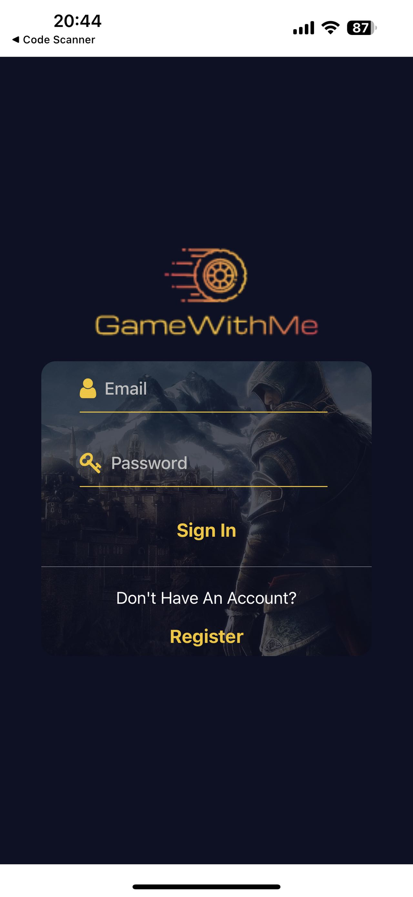
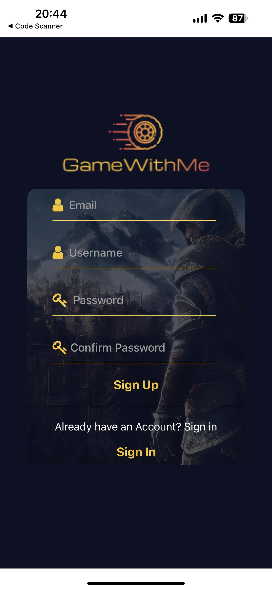
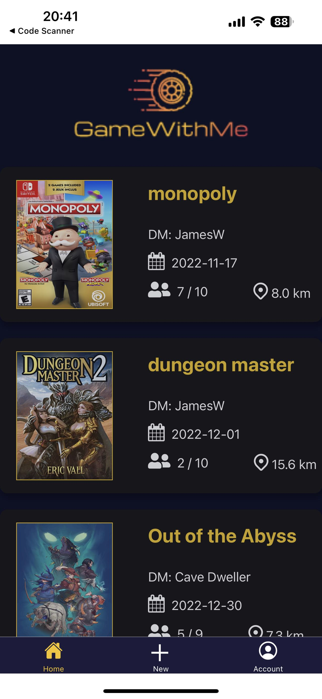
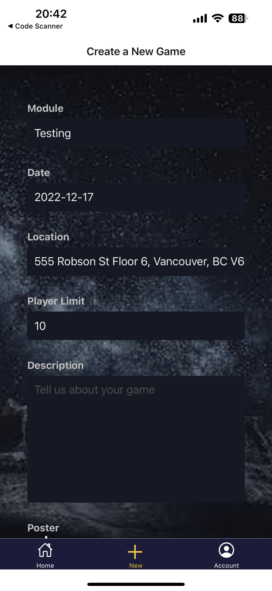
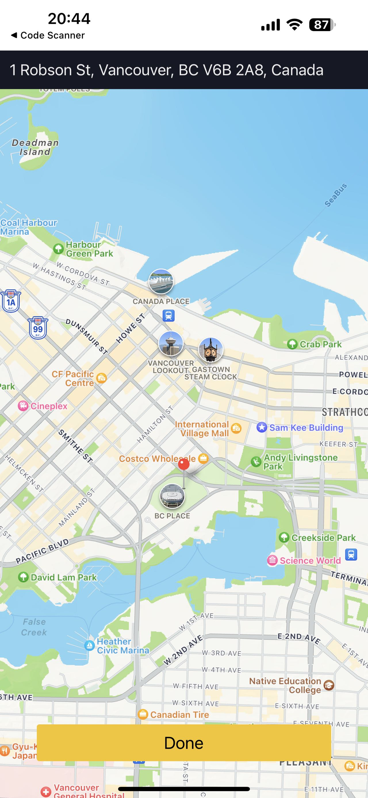
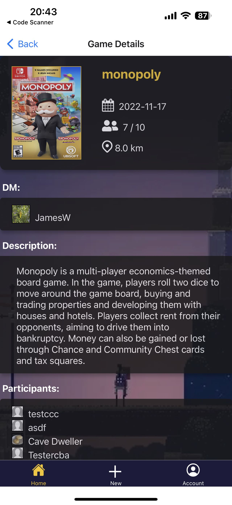
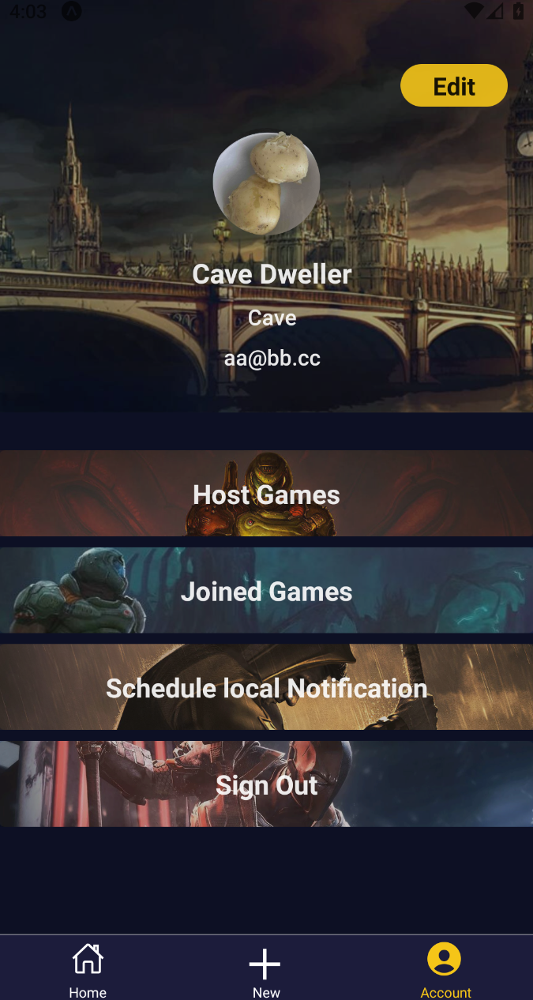
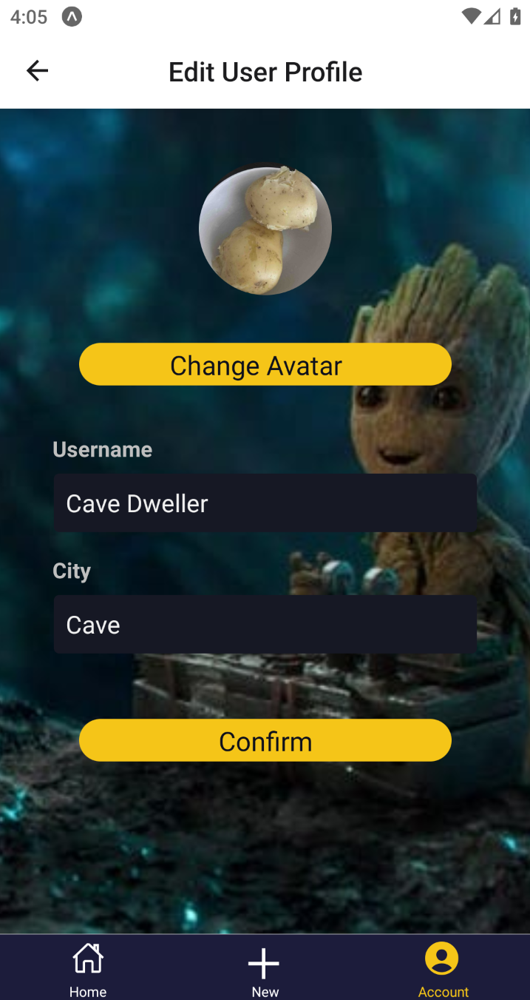
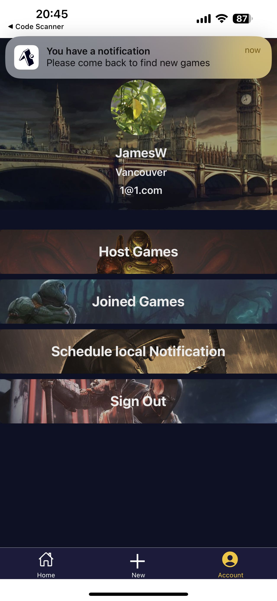

# GameWithMe

CS5520-Fall 2022-Final Project

## Screenshots
### Sign-in



### Sign-up



### Home



### CreateNewGame



### Choose location



### GameDetail



### UserProfile



### EditUserProfile



### Notification




## Team members

- Shuyue Gao (MaisieGao)
- Jiaqi Song (zzarc)
- Jiesi Zhang (zjsjayce)

## Data Model

```
GameWithMe
├── users(collection)
│   ├── id(string)
│   ├── username(string)
│   ├── email(string)
│   ├── city(string)
│   ├── avatar(string)
│   ├── hosted(array[reference(game)])
│   └── joined(array[reference(game)])
|
└── games(collection)
    ├── id(string)
    |── title(string)
    ├── dmRef(reference(user))
    ├── date(string)
    ├── location(map)
    │   ├── name(string)
    │   ├── lat(string)
    │   ├── lng(string)
    │   └── geohash(string)
    ├── playerLimit(int)
    ├── participants(array[reference(user)])
    ├── poster(string)
    └── description(string)
```

## Security Rules

```
rules_version = '2';
service cloud.firestore {
  match /databases/{database}/documents {
    // default rule
    // match /{document=**} {
    //   allow read, write: if
    //     request.time < timestamp.date(2022, 12, 14);
    // }
  
    // Allow user to read only if authenticated
    // Allow to users collection if the request is authenticated and the user is the owner of the document.
    match /users/{userId} {
      allow read: if request.auth != null;
      allow create: if true; // allow any user to create account
      allow update, delete: if request.auth != null && request.auth.uid == userId;
    }

    // Allow user to read only if authenticated
    // Allow create game if user is authenticated
    // Allow update to games collection from users by adding their own ID without modifying other users IDs or user is the DM
    match /games/{gameId} {
      allow read: if request.auth != null;
      allow create: if request.auth != null;
      allow update: if request.auth != null && 
      (
        (
          // user adding their own id
          request.resource.data.participants.hasAll(resource.data.participants) &&
          request.resource.data.participants.hasAll([/databases/$(database)/documents/users/$(request.auth.uid)]) &&
          request.resource.data.participants.size() == resource.data.participants.size() + 1
        ) ||
        (
          // game owner
          request.auth.uid == get(resource.data.dmRef).id
        ) ||
        (
          // user removing their own id
          resource.data.participants.hasAll([/databases/$(database)/documents/users/$(request.auth.uid)]) &&
          resource.data.participants.hasAll(request.resource.data.participants) &&
          !request.resource.data.participants.hasAll([/databases/$(database)/documents/users/$(request.auth.uid)]) &&
          request.resource.data.participants.size() == resource.data.participants.size() - 1        
        )
      );
      // game owner
      allow delete: if request.auth != null && request.auth.uid == get(resource.data.dmRef).id;
    }
  }
}
```

## External API

We use Google Maps API for location indication, validation and geocoding.

## Todo

### CreateNewGame/EditGame screen

- [x] UI Optimization
- [x] data validation
- [x] button positioning
- [x] adding image
- [x] create new game with data and store to firestore
- [x] location hint when typing / add map pin feature (probably gonna do this in iteration2)

### Home

- [x] try to access user's current location
- [x] in card, show game's distance to the user

### Firebase

- [x] create API for image handling
- [x] create API for populating a list of reference
- [x] create API for player join/quit/removed
- [x] implement cascade deletion

### Notification

- [x] created local notification
- [x] create handle to receive notification from Expo Notification tools(https://expo.dev/notifications)

### Camera

- [x] create Camera use in edit game and edit account pages

### Misc

- [x] image cache (react-native/expo doesn't have image cache, firebase has only 1GB quota per day)
- [x] use colors from Color.js instead of manually specifying colors (requirement)
- [x] wrap Pressable as a component with visual feedback (requirement)
- [x] force user to login without letting them route to Home or any other screens (requirement)
- [x] quit game option
- [x] delete game option


## Contributions

to TA: we allow emergency bugfixes and trivial changes(README.md) directly pushed to dev branch

### Shuyue Gao (MaisieGao)

- Created components such as card and button
- Created Home page with the list of cards
- Created Account page that contains user info and buttons to signOut
- Created HostGames page with the list of hosted games of the user
- Created JoinedGames page with the list of joined games of the user
- Created signIn page and upload user info in firebase
- Created signUp page and upload user info in firebase
- Added authentication and direct users to different pages according to their identities
- Changed background pictures and button pictures for all pages
- adjust styles so it fits both ios and android platform
- make signin page the front page and block the users from seeing the app when not signed in

### Jiaqi Song (zzarc)

- wrapped firebase api
- Form components for handling user input
- CreateNewGame screen
- EditGame screen
- EditAccount screen
- Location Picker/Distance
- Image Cache

### Jiesi Zhang (zjsjayce)

- Created navigations for the whole application
- Created Game detail page which contained some components and related logics
- Developed Notification
- Fixed bugs
- Test the whole processing
- Color consisted


## Special Notice

### Location
- If you use our application at simulator, you could not get your own location.

### Calculate Distance at GameDetail Page
- Please wait for a few seconds for the App to acquire the latest location, in order to calculate the distance in the game cards on the home page (the question mark will become real distance after a few seconds of loading).
- Because we use Heroku cors proxy for Google Maps APIs, please wait for a few seconds if the location autocompletion is not showing. This is because Heroku itself has some optimization mechanisms which freeze our proxy if it is not being used for a while.

### Take pictures using camera
- Because of the Firestore quota issue and the bug mentioned in ```https://github.com/firebase/firebase-js-sdk/issues/5848#issuecomment-1039982630```, we only allow user to upload image in lowest quality.
- And sometimes when taking a picture using the camera with an andriod phone, expo will reload. It is also a bug that was mentioned in ```https://github.com/ivpusic/react-native-image-crop-picker/issues/955``` using expo-image-picker. If your phone is android, please retake the picture again. It will do the job after a few reloads.


### Notification
- If you use our application at simulator, you could not receive notification from Expo tool.


## Youtube Link
https://www.youtube.com/watch?v=7ePzGjD3pNc

